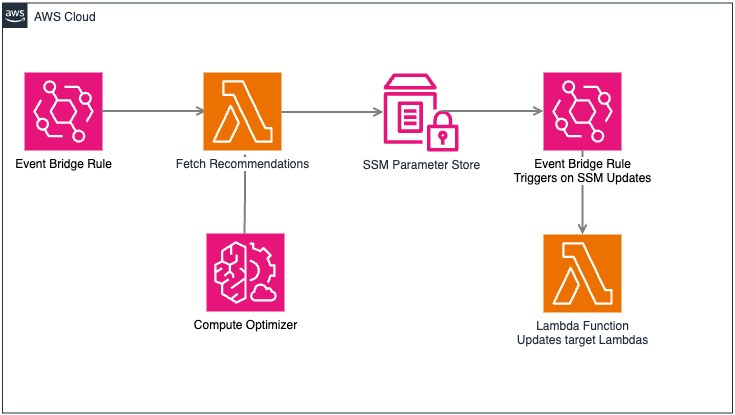

# AWS Cost Optimizer - Unified Solution

## Overview

This solution provides a comprehensive, automated approach to optimize costs across multiple AWS services using AWS Compute Optimizer. It includes optimization for:

- EC2 Instances
- EC2 Auto Scaling Groups
- RDS Instances
- Lambda Functions

The solution uses AWS Compute Optimizer's machine learning-powered recommendations to automatically identify and implement cost-saving opportunities while maintaining performance.

If you want to deploy only specific optimizer component, then go to the respective folder and follow the README file.

## Architecture



### Components

1. **AWS Compute Optimizer**
   - Analyzes utilization metrics
   - Provides instance type recommendations
   - Supports multiple resource types

2. **AWS Lambda Functions**
   - Fetches recommendations from Compute Optimizer
   - Updates SSM Parameters with recommendations
   - Implements recommended changes

3. **Amazon EventBridge**
   - Schedules regular optimization checks
   - Triggers updates based on parameter changes

4. **AWS Systems Manager Parameter Store**
   - Stores optimization recommendations
   - Maintains history of changes
   - Enables easy integration with IaC

5. **AWS CloudFormation**
   - Deploys all components
   - Manages infrastructure as code
   - Handles updates and deletions

## Prerequisites

1. AWS Account with appropriate permissions
2. AWS CLI installed and configured
3. AWS Compute Optimizer enabled in your account
4. Python 3.8 or later
5. Sufficient IAM permissions to create:
   - IAM Roles and Policies
   - Lambda Functions
   - EventBridge Rules
   - SSM Parameters

## Deployment

### Quick Start

1. **Enable AWS Compute Optimizer:**
    ```bash
    aws compute-optimizer update-enrollment-status --status Active
    ```

2. **Deploy the CloudFormation Stack:**
    ```bash
    aws cloudformation create-stack \
        --stack-name aws-cost-optimizer \
        --template-body file://templates/aws-cost-optimizer-template.yml \
        --capabilities CAPABILITY_NAMED_IAM
    ```

3. **Monitor Stack Creation:**
    ```bash
    aws cloudformation describe-stacks \
        --stack-name aws-cost-optimizer \
        --query 'Stacks[0].StackStatus'
    ```

### Detailed Deployment Steps

1. **Clone the Repository:**
    ```bash
    git clone https://github.com/zechariahks/aws-cost-optimizer-solution
    cd aws-cost-optimizer
    ```

2. **Review and Customize Parameters:**
    - Open `templates/aws-cost-optimizer-template.yml`
    - Adjust the following parameters as needed:
        - Schedule expressions for optimization checks
        - Lambda function timeouts and memory
        - Resource naming conventions

3. **Deploy the Stack:**

    **Using AWS Console:**
    - Open CloudFormation console
    - Click "Create stack"
    - Upload template file
    - Follow the wizard steps

    **Using AWS CLI:**
    ```bash
    aws cloudformation create-stack \
        --stack-name aws-cost-optimizer \
        --template-body file://templates/aws-cost-optimizer-template.yml \
        --capabilities CAPABILITY_NAMED_IAM \
        --parameters \
            ParameterKey=OptimizerScheduleExpression,ParameterValue="rate(1 day)" 
    ```

### Review the cost-optimization results

Once the deployment is complete, depending on when the Cost Optimization status became active in the account, it takes around 24 hours to generate recommendations. Event Bridge rules are scheduleed to run daily at once. Lambda functions will be invoked on this schedule and update the resource configurations as per the Compute Optimizer recommendations. 

### Clean Up

1. **Delete the CloudFormation Stack:**
    ```bash
    aws cloudformation delete-stack --stack-name unified-cost-optimizer
    aws cloudformation wait stack-delete-complete --stack-name unified-cost-optimizer
    ```

2. **Clean Up SSM Parameters:**
    ```bash
    # Remove all optimization parameters
    aws ssm get-parameters-by-path --path "/cost-optimizer" --recursive | \
    jq -r '.Parameters[].Name' | \
    while read param; do
        aws ssm delete-parameter --name "$param"
    done
    ```

### Best Practices

1. **Implementation:**
    - Deploy in test environment first
    - Use gradual rollout strategy
    - Implement proper monitoring
    - Document all configurations
    - Use resource tagging

2. **Security:**
    - Follow least privilege principle
    - Encrypt sensitive data
    - Implement error handling
    - Regular security audits
    - Monitor API calls

3. **Operations:**
    - Regular backup of configurations
    - Monitor performance metrics
    - Set up alerting
    - Document procedures
    - Test rollback processes

4. **Cost Management:**
    - Monitor optimization savings
    - Review recommendations regularly
    - Set up cost allocation tags
    - Implement budget alerts
    - Clean up unused resources

### Troubleshooting

1. **Common Issues:**
    - Compute Optimizer not enabled
    - Insufficient IAM permissions
    - Lambda timeout issues
    - Parameter Store throttling
    - Resource modification failures

2. **Resolution Steps:**
    - Check CloudWatch Logs
    - Verify IAM roles
    - Monitor service quotas
    - Review error messages
    - Check service health

### Support

For issues and feature requests:
- Open an issue in the GitHub repository
- Provide detailed description
- Include error messages
- Share relevant logs
- Describe expected behavior

### Contributing

1. Fork the repository
2. Create feature branch
3. Commit changes
4. Push to branch
5. Create Pull Request

### License

This project is licensed under the MIT License - see the LICENSE file for details.
