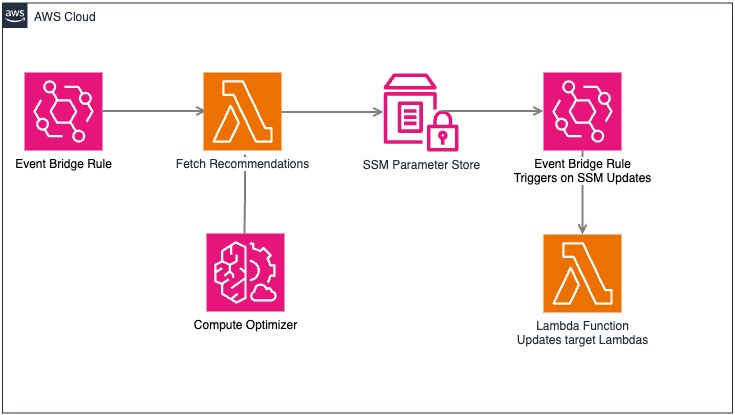

# Optimize AWS Lambda Costs with Automated Compute Optimizer Insights

## Description

This blog explores an automated and scalable method for optimizing AWS Lambda memory configurations to enhance cost efficiency and performance. By leveraging AWS Compute Optimizer, memory recommendations are dynamically stored in AWS SSM Parameter Store, allowing for seamless integration with Infrastructure-as-Code (IaC) deployments. An EventBridge Scheduler triggers a Lambda function periodically, fetching Compute Optimizer insights, analyzing them, and updating the corresponding SSM parameters. Additionally, an EventBridge rule listens for SSM Parameter Store updates and triggers a Lambda function to adjust the memory configuration dynamically, ensuring continuous optimization of Lambda function memory allocations with minimal manual intervention.

---

## Introduction

AWS Lambda offers a flexible way to run serverless applications, but selecting the optimal memory configuration can be challenging. Over-provisioning leads to unnecessary costs, while under-provisioning can impact performance. AWS Compute Optimizer provides recommendations for memory adjustments based on real-time usage data. Automating this process ensures continuous cost savings and optimal performance.

---

## Architecture Overview



### Components Used:

1. **AWS Compute Optimizer** – Provides memory recommendations for Lambda functions.
2. **AWS SSM Parameter Store** – Stores optimal memory configurations.
3. **AWS Lambda (for automation)** – Fetches recommendations and updates parameters.
4. **Amazon EventBridge Scheduler** – Triggers the optimization workflow periodically.
5. **Amazon EventBridge Rule** – Listens for SSM parameter updates and triggers Lambda updates.
6. **AWS CloudFormation/Terraform** – Dynamically references SSM parameters during deployment.

Source Code in this article is located here https://github.com/zechariahks/aws-cost-optimizer-solution/lambda/. Feel free to provide your feedback.

---

## Implementation Steps

### Step 1: Enable AWS Compute Optimizer for Lambda

In order to use Compute Optimizer in an account, It should be enabled first. Follow below steps to enable Compute Otpimizer.

#### Using AWS Console:
1. Navigate to the **AWS Compute Optimizer** console.
2. Click on **Get Started** and choose **Opt In**.
3. Ensure Compute Optimizer has sufficient time (at least 24 hours) to analyze Lambda metrics.

#### Using AWS CLI:

Run below command on the terminal to enable Compute Optimizer.

```sh
aws compute-optimizer update-enrollment-status --status Active
```

### Step 2: Store Memory Configurations in AWS SSM Parameter Store

#### Using AWS Console:
1. Open the **AWS Systems Manager Parameter Store**.
2. Click **Create parameter** and specify a name (e.g., `/lambda/memory/MyFunction`).
3. Set the parameter type as **String** and enter an initial memory value.

#### Using AWS CLI:
```sh
aws ssm put-parameter --name "/lambda/memory/MyFunction" --value "512" --type "String" --overwrite
```

### Step 2: Create IAM Roles

#### Using AWS Console:

1. Navigate to IAM Console
2. Create role for Compute Optimizer Lambda:
    - Choose Lambda as the service
    - Add these policies:
        - AWSLambdaBasicExecutionRole
        - Custom policy for Compute Optimizer access
        - Custom policy for SSM Parameter Store access
3. Create role for Update Lambda:
    - Choose Lambda as the service
    - Add these policies:
        - AWSLambdaBasicExecutionRole
        - Custom policy for Lambda actions
        - Custom policy for SSM Parameter Store access

#### Using AWS CLI:

Run below commands to create the required IAM Roles and policies.

```sh
# Create Compute Optimizer Lambda Role
OPTIMIZER_ROLE_ARN=$(aws iam create-role \
    --role-name lambda_optimizer_role \
    --assume-role-policy-document '{
        "Version": "2012-10-17",
        "Statement": [{
            "Effect": "Allow",
            "Principal": {
                "Service": "lambda.amazonaws.com"
            },
            "Action": "sts:AssumeRole"
        }]
    }' \
    --query 'Role.Arn' \
    --output text)


# Attach necessary policies
aws iam attach-role-policy \
    --role-name lambda_optimizer_role \
    --policy-arn arn:aws:iam::aws:policy/service-role/AWSLambdaBasicExecutionRole

aws iam put-role-policy \
    --role-name lambda_optimizer_role \
    --policy-name ComputeOptimizerAccess \
    --policy-document '{
        "Version": "2012-10-17",
        "Statement": [{
            "Effect": "Allow",
            "Action": [
                "compute-optimizer:GetLambdaFunctionRecommendations",
                "ec2:DescribeInstances",
                "ssm:PutParameter"
            ],
            "Resource": "*"
        }]
    }'

# Create Update Lambda Role
UPDATE_ROLE_ARN=$(aws iam create-role \
    --role-name lambda_update_role \
    --assume-role-policy-document '{
        "Version": "2012-10-17",
        "Statement": [{
            "Effect": "Allow",
            "Principal": {
                "Service": "lambda.amazonaws.com"
            },
            "Action": "sts:AssumeRole"
        }]
    }' \
    --query 'Role.Arn' \
    --output text)

# Attach necessary policies
aws iam attach-role-policy \
    --role-name lambda_update_role \
    --policy-arn arn:aws:iam::aws:policy/service-role/AWSLambdaBasicExecutionRole

aws iam put-role-policy \
    --role-name lambda_update_role \
    --policy-name UpdateLambdaConfig \
    --policy-document '{
        "Version": "2012-10-17",
        "Statement": [{
            "Effect": "Allow",
            "Action": [
                "lambda:UpdateFunctionConfiguration",
                "ssm:GetParameter"
            ],
            "Resource": "*"
        }]
    }'
```

### Step 3: Create a Lambda Function to Fetch Compute Optimizer Recommendations

#### Create a Python Lambda function (`compute_optimizer_lambda.py`):
```python
import boto3

def get_lambda_recommendations():
    client = boto3.client('compute-optimizer')
    response = client.get_lambda_function_recommendations()
    
    ssm_client = boto3.client('ssm')
    
    for recommendation in response['lambdaFunctionRecommendations']:
        function_arn = recommendation['functionArn']
        memory_size = recommendation['memorySizeRecommendationOptions'][0]['rankedOptions'][0]['memorySize']
        param_name = f"/lambda/memory/{function_arn.split(':')[-1]}"
        
        ssm_client.put_parameter(
            Name=param_name,
            Value=str(memory_size),
            Type='String',
            Overwrite=True
        )

    return {'status': 'Success'}
```

#### Deploy the Lambda function using AWS CLI:
```sh
zip compute_optimizer_lambda.zip compute_optimizer_lambda.py

OPTIMIZER_FUNCTION_ARN=$(aws lambda create-function \
    --function-name compute_optimizer_lambda \
    --runtime python3.13 \
    --role "$OPTIMIZER_ROLE_ARN" \
    --handler compute_optimizer_lambda.get_lambda_recommendations \
    --zip-file fileb://compute_optimizer_lambda.zip \
    --query 'FunctionArn' \
    --output text)
    
```

### Step 4: Schedule Execution with EventBridge

#### Using AWS Console:
1. Open **Amazon EventBridge Scheduler**.
2. Create a new schedule to trigger the Lambda function periodically (e.g., daily or weekly).

#### Using AWS CLI:
```sh
aws events put-rule --schedule-expression "rate(1 day)" --name LambdaMemoryOptimization
aws events put-targets --rule LambdaMemoryOptimization --targets "Id"="1","Arn"="$OPTIMIZER_FUNCTION_ARN"
```

### Step 5: Create an EventBridge Rule to Detect SSM Parameter Updates and Adjust Lambda Configuration

#### Create a Lambda function to update memory configuration (`update_lambda_memory.py`):
```python
import boto3

def update_lambda_memory(function_name, memory_size):
    lambda_client = boto3.client('lambda')
    lambda_client.update_function_configuration(
        FunctionName=function_name,
        MemorySize=int(memory_size)
    )

def lambda_handler(event, context):
    ssm_client = boto3.client('ssm')
    function_name = event['detail']['name'].split("/")[-1]
    response = ssm_client.get_parameter(Name=event['detail']['name'])
    memory_size = response['Parameter']['Value']
    
    update_lambda_memory(function_name, memory_size)
    return {'status': 'Updated Lambda memory'}
```


#### Deploy the Lambda function update_lambda_memory using AWS CLI:
```sh
zip update_lambda_memory_function.zip update_lambda_memory.py

UPDATE_FUNCTION_ARN=$(aws lambda create-function \
    --function-name update_lambda_memory \
    --runtime python3.13 \
    --role "$UPDATE_ROLE_ARN" \
    --handler update_lambda_memory.lambda_handler \
    --zip-file fileb://update_lambda_memory_function.zip \
    --query 'FunctionArn' \
    --output text)
    
```

#### Configure EventBridge rule to trigger update_lambda_memory function:
```sh
aws events put-rule --name "SSMParameterChangeRule" --event-pattern '{
  "source": ["aws.ssm"],
  "detail-type": ["Parameter Store Change"],
  "detail": { "operation": ["Update"], "name": [{"prefix": "/lambda/memory/"}] }
}'

aws events put-targets --rule SSMParameterChangeRule --targets "Id"="1","Arn"="$UPDATE_FUNCTION_ARN"
```

### Step 6: Create/Modify IaC (CloudFormation Template) to Use SSM Parameters

#### Example in CloudFormation:
```yaml
Resources:
  LambdaExecutionRole:
    Type: 'AWS::IAM::Role'
    Properties:
      RoleName: basic-lambda-execution-role
      AssumeRolePolicyDocument:
        Version: '2012-10-17'
        Statement:
          - Effect: Allow
            Principal:
              Service:
                - lambda.amazonaws.com
            Action:
              - 'sts:AssumeRole'
      ManagedPolicyArns:
        - 'arn:aws:iam::aws:policy/service-role/AWSLambdaBasicExecutionRole'
      Path: '/'

  MyLambdaFunction:
    Type: AWS::Lambda::Function
    Properties:
      FunctionName: MyFunction
      MemorySize: !Ref MemoryParameter
      Handler: index.lambda_handler
      Role: !GetAtt LambdaExecutionRole.Arn
      Code: 
        ZipFile: |
          def lambda_handler(event, context):
            return {
                'statusCode': 200,
                'body': 'Hello from Lambda!'
            }
      Runtime: python3.12
Parameters:
  MemoryParameter:
    Type: AWS::SSM::Parameter::Value<String>
    Default: /lambda/memory/MyFunction
```

## Deploy the CloudFormation Stack using CLI

```
aws cloudformation create-stack --stack-name lambdastack --template-body file://sample-lambda.yml --capabilities CAPABILITY_NAMED_IAM
```
---

## Deploy the infrastructure stack 

If you want to use CloudFormation to deploy all the above resources, you can use the template lambda-optimizer-template.yml located at https://github.com/zechariahks/aws-cost-optimizer-solution/lambda/templates/ location.

```
aws cloudformation create-stack --stack-name lambda-cost-optimization --template-body file://lambda-optimizer-template.yml \
    --capabilities CAPABILITY_NAMED_IAM
```

### Script to invoke lambda function to generate recommendations
As per the [documentation](https://docs.aws.amazon.com/compute-optimizer/latest/ug/requirements.html#requirements-lambda-functions), lambda function must be invoked at least 50 times in the lat 14 days to generate recommendations. You can use below script for invoking your lambda function.

```sh
#!/bin/bash

FUNCTION_NAME="MyFunction"

for i in {1..100}; do
    aws lambda invoke \
        --function-name $FUNCTION_NAME \
        --invocation-type Event \
        --cli-binary-format raw-in-base64-out \
        --payload '{"message": "test"}' \
        /dev/null > /dev/null 2>&1

    echo "Invocation $i sent"
    
    # Optional: Add small delay to prevent throttling
    sleep 0.1
done

echo "All invocations completed"
```

## Conclusion

This solution ensures continuous Lambda memory optimization using AWS Compute Optimizer, SSM Parameter Store, and EventBridge. The new approach removes the need for Step Functions, streamlining the process while ensuring Lambda functions are dynamically updated based on Compute Optimizer recommendations.

## Resources:

- **Github Repository:** https://github.com/zechariahks/aws-cost-optimizer-solution

- **AWS Compute Optimizer documentation:** https://docs.aws.amazon.com/compute-optimizer/latest/ug/getting-started.html

- **AWS Lambda documentation:** https://docs.aws.amazon.com/lambda/latest/dg/welcome.html

## Clean up

If you used CLI commands to create the resources, then run the following commands to clean up the resources. Update the commands appropriately to align with your resource names.

```sh
# 1. Delete EventBridge Rules
aws events remove-targets --rule LambdaMemoryOptimization --ids "ComputeOptimizerLambda"
aws events delete-rule --name LambdaMemoryOptimization

aws events remove-targets --rule SSMParameterChangeRule --ids "UpdateLambdaMemory"
aws events delete-rule --name SSMParameterChangeRule

# 2. Delete Lambda Functions
aws lambda delete-function --function-name compute_optimizer_lambda
aws lambda delete-function --function-name update_lambda_memory

# 3. Delete IAM Roles and their policies 
aws iam delete-role-policy --role-name lambda_optimizer_role --policy-name ComputeOptimizerAccess
aws iam detach-role-policy --role-name lambda_optimizer_role --policy-arn arn:aws:iam::aws:policy/service-role/AWSLambdaBasicExecutionRole
aws iam delete-role --role-name lambda_optimizer_role

aws iam delete-role-policy --role-name lambda_update_role --policy-name UpdateLambdaConfig
aws iam detach-role-policy --role-name lambda_update_role --policy-arn arn:aws:iam::aws:policy/service-role/AWSLambdaBasicExecutionRole
aws iam delete-role --role-name lambda_update_role

# 4. Clean up any SSM Parameters created
aws ssm get-parameters-by-path --path "/lambda/memory/" --recursive | \
jq -r '.Parameters[].Name' | \
while read param; do
    aws ssm delete-parameter --name "$param"
done

# 5. Disable Compute Optimizer (optional - only if you don't need it for other resources)
aws compute-optimizer update-enrollment-status --status Inactive

```

If you used CloudFormation template to create the infrastructure, then run below command to delete the stack.

```sh
aws cloudformation delete-stack --stack-name lambda-cost-optimization
```


